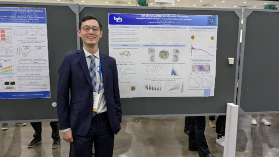

**Thank you for visiting my page!** I hope this page provides you with a comprehensive view of my journey as a **computational chemist**.

I am currently a **4th-year PhD candidate in computational chemistry** at the **State University of New York at Buffalo**. My research focuses on **developing molecular dynamics simulation models to study ribonucleic acids (RNA)** and their structural and phase separation properties.

This summer, I will be joining the **Platform Chemistry team at Enveda Biosciences**, where I will contribute to advancing the **computational pipeline for natural product hit-to-lead discovery**. I am excited to apply my expertise in molecular modeling to accelerate drug discovery efforts.

Feel free to connect with me on [Linkedin](https://www.linkedin.com/in/hepzh/) or explore my projects on [Github](https://github.com/peter-zhang-chem).

  

