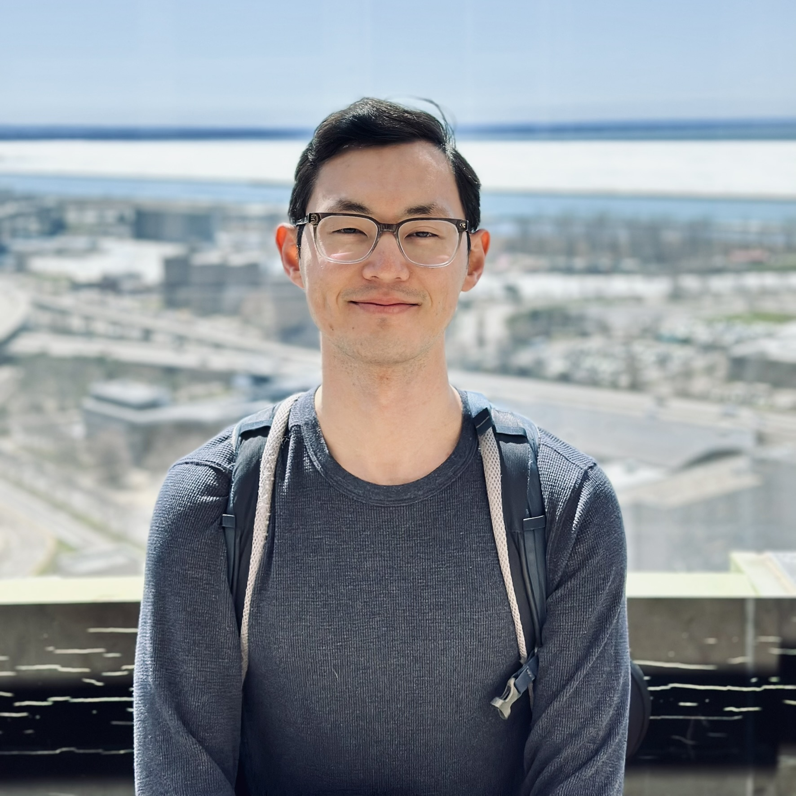

  

    

    <blockquote class="value-quote">
      “We should publish great science, but more importantly, we must translate it into therapeutics to benefit patients — after all, at the end of the day, we are all patients.”
      — Atul Butte
    </blockquote>
  

  

    
<strong> Hi! Thanks for taking the time to learn a bit more about me. I hope this page will give you a sense of my scientific motivations, what I've done, and where I'm going.</strong>

    
 I am a fifth-year PhD student at SUNY Buffalo. My long-term career goal is to develop therapies that make a real impact in patients' lives by putting drugs on the market that improve outcomes and bring hope to patients.

    
 My scientific journey started in organic synthesis during my undergraduate years, where I worked on designing and synthesizing lipid molecules for RNA delivery. Although the COVID-19 pandemic interrupted part of my undergraduate research, I was able to nevigate the restrictions and continue work on the project and completed an honors thesis, which has since grown into an NIH-funded program supporting many students.

    
 Caught the research bug, I joined SUNY Buffalo for graduate school to continue my training in synthetic and chemical biology. For my master's research, I developed novel bioorthogonal probes and explored incorporating unnatural amino acids into proteins to do click chemistry for the purpose of drug target identification - an approach I still find very interesting.

    
 Around that time, AlphaFold was released and making big improvements, and I was amazed by what computational chemistry could achieve. When a new faculty member joined our department focusing on molecular dynamics simulations of RNA, I saw an oppourtunity to bridge my chemistry knowledge with computation. After joining Prof. Hung Nguyen's Bio Simulation lab, I began studying RNA structure, ion interactions, and phase behavior through MD simulations. I've enjoyed doing computational chemistry since then and I can honestly say this was one of the best career decisions I've made.

    
 In summer 2025, I had an incredible oppourtunity to intern at Enveda, a biotech startup in Boulder, Colorado. There, I contributed to real-world drug discovery by developing an in silico bioactivity prediction pipline using shape and electrostatic similarity analysis. Working alongside medicinal chemists and seeing how computation drives decision-making in early discovery reaffirmed my desire to work at the interface of chemistry, computation, and theraputics.

    
 Over the past year, I've spoken with many inspiring computational chemists in the pharmaceutical industry who share a common purpose - transforming scientific insights into therapeutic solutions that brings hope to patients. I am deeply motivated by similar personal experiences: losing loved ones to illness and witnessing the toll of diseases like cancer. These experiences continue to remind me why I do what I do - to help bring peace, health, and hope to families through science.

    
Please feel free to connect with me on <a href="https://www.linkedin.com/in/hepzh/">LinkedIn</a> or explore my projects on <a href="https://github.com/peter-zhang-chem">GitHub</a> and <a href="https://scholar.google.com/citations?user=HaxobcoAAAAJ&hl=en">Google Scholar</a>.

  

